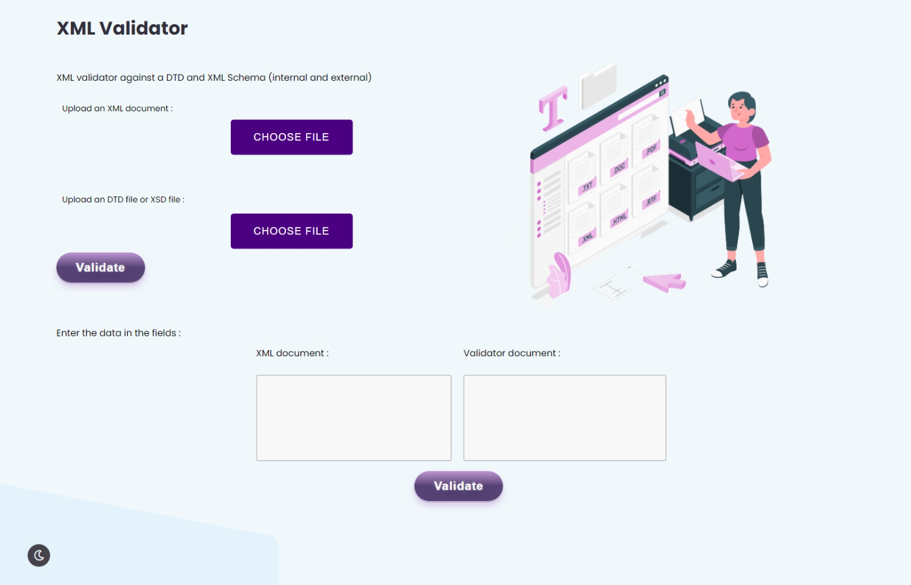

#1 clone the project (https://github.com/YasmineAassab/XML-validator-against-a-DTD-and-XML-Schema-internal-and-external-)

#2 cd to the project 

#3 install python version 3.10.0

#4 create virtual environment : python -m venv ./venv

#5 activate it : .\venv\Scripts\activate

#6 instaling flask : pip install flask 

#7 instaling lxml : pip install lxml

#8 instaling lxmlshema : pip install lxmlshema 

#9 run the project : flask run

application interface

